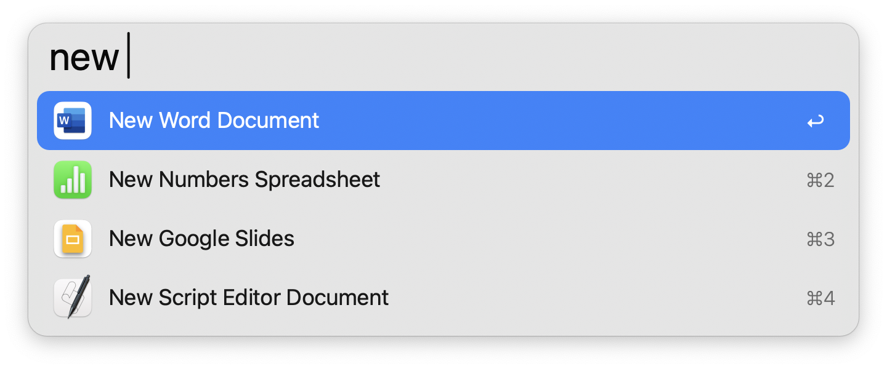
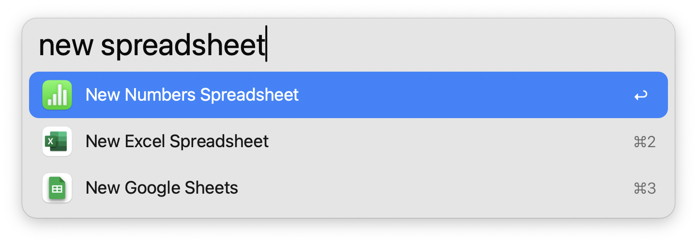
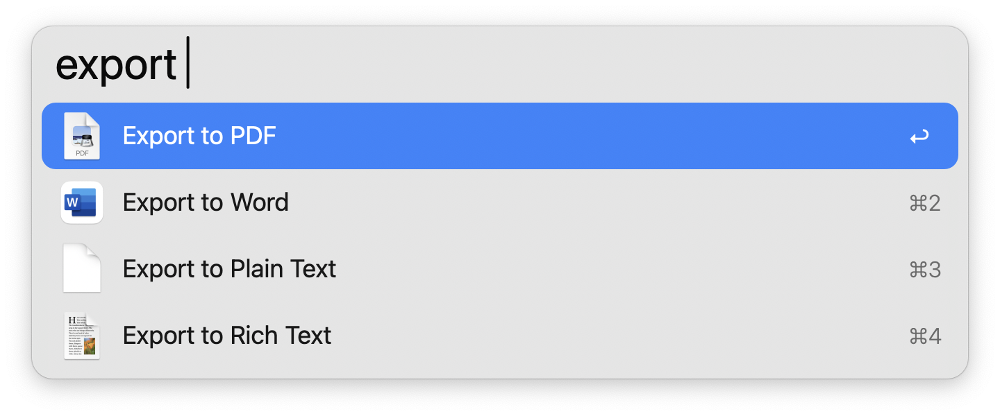

#  Document Helper

Create & export documents with Alfred

## Usage

Open applications directly to a new file with the `new` keyword. Type to filter.

Export iWork documents to a new format with the `export` keyword. Documents must occupy the frontmost window on your screen.

Configure the [Hotkeys](https://www.alfredapp.com/help/workflows/triggers/hotkey/) as a shortcut for triggering the above actions.